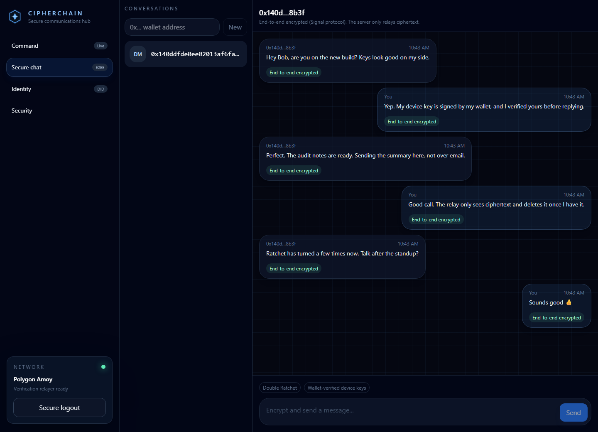
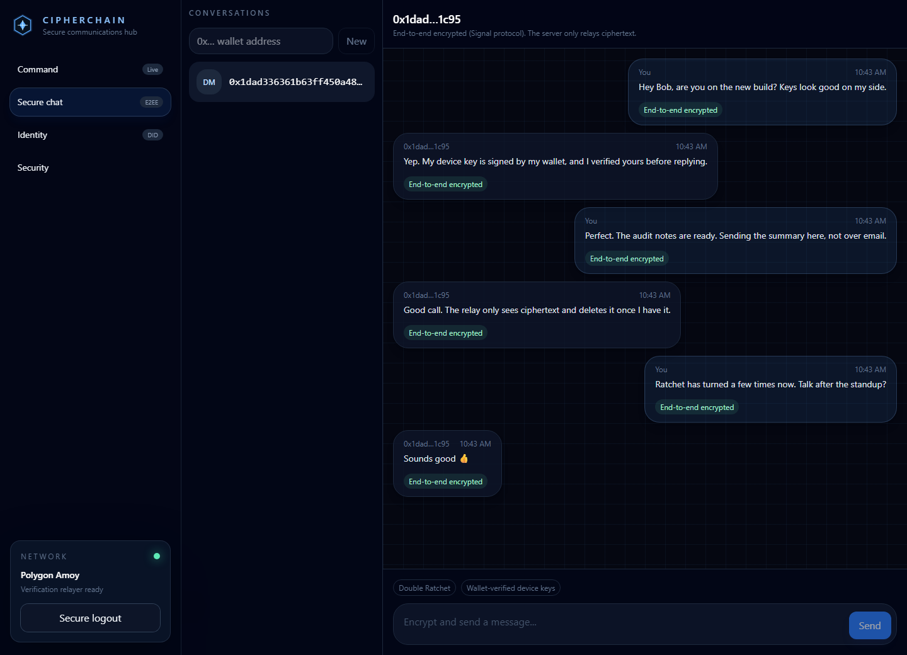
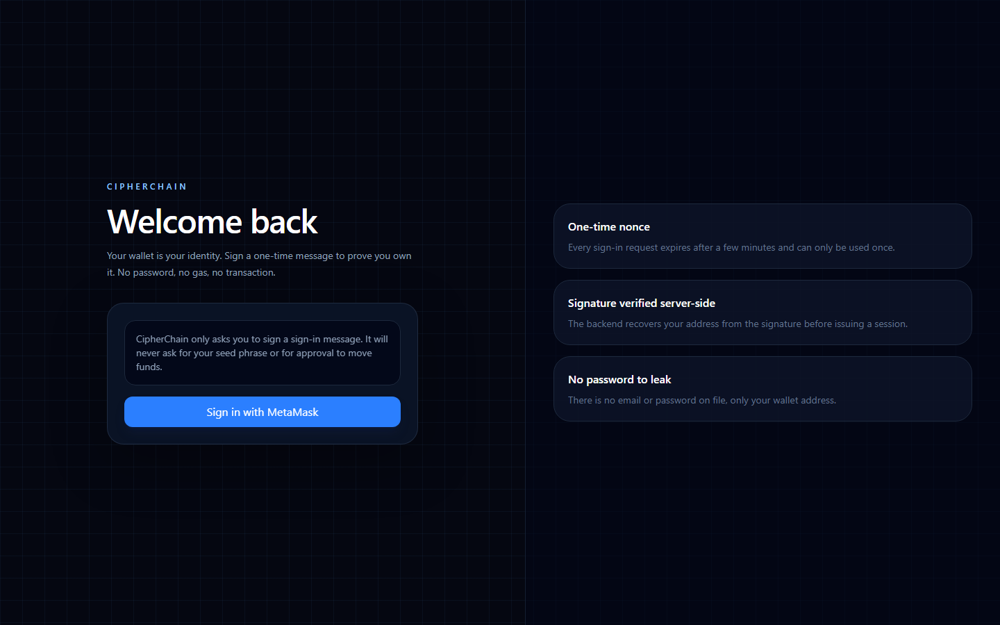
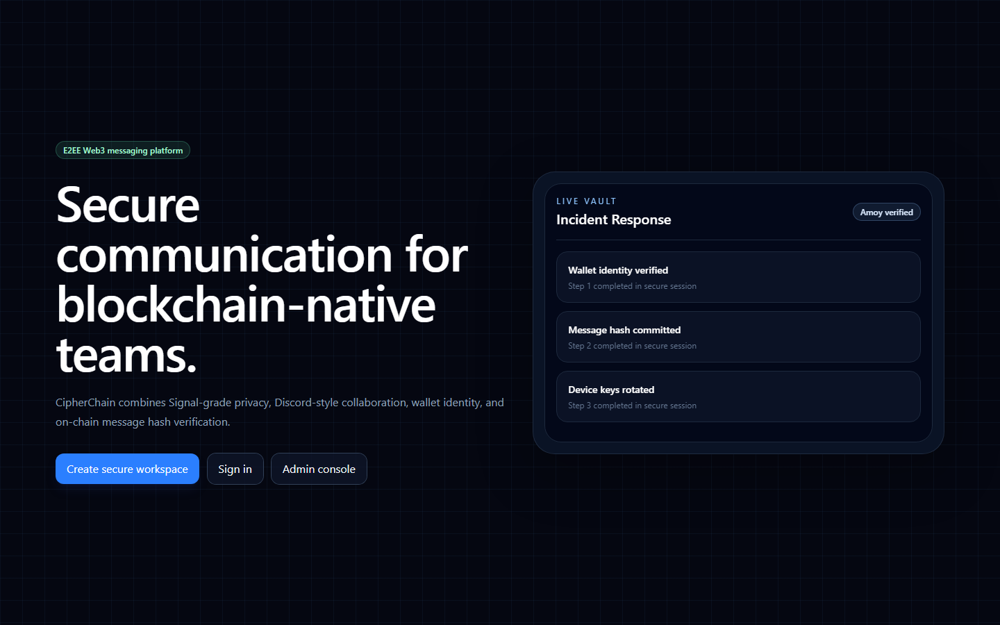
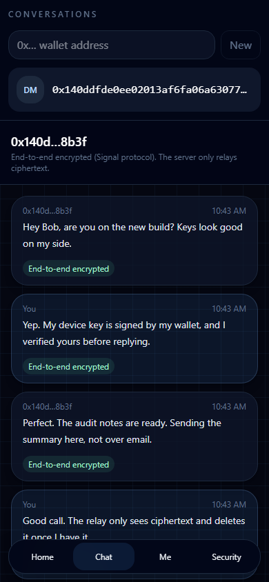
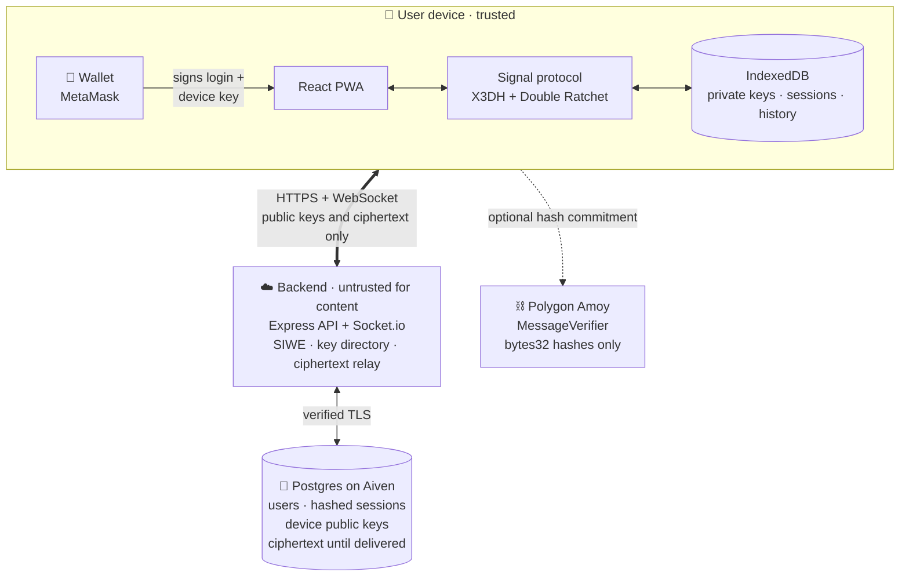
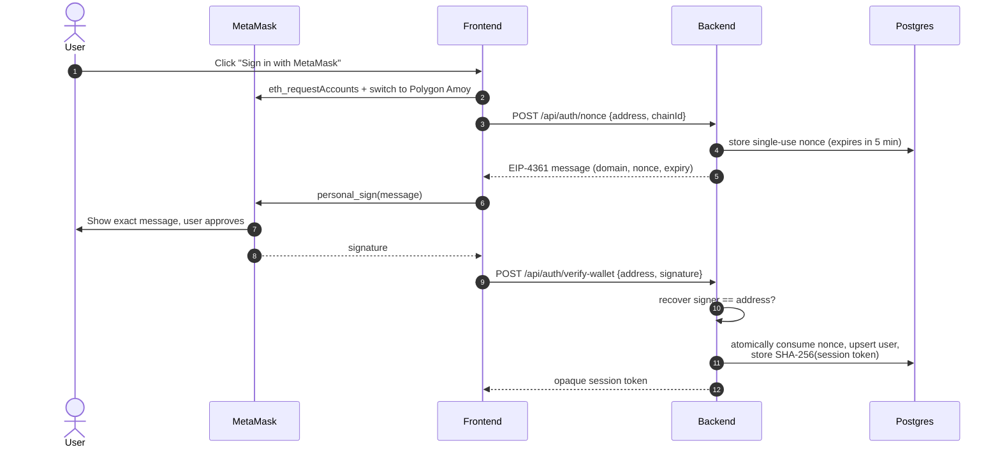
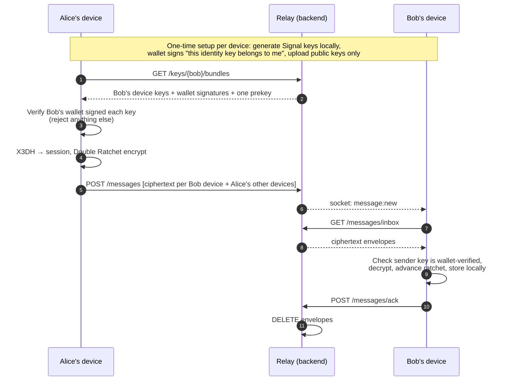

<div align="center">

# CipherChain

**End-to-end encrypted messaging where your wallet is your identity.**

Signal-protocol encryption · Sign-In with Ethereum · The server only ever sees ciphertext

[](https://github.com/Daddyk5/CipherChain/actions/workflows/ci.yml)
[](LICENSE)




</div>

---

## Table of contents

- [Why CipherChain](#why-cipherchain)
- [Screenshots](#screenshots)
- [How it works](#how-it-works)
- [Security model](#security-model)
- [Quick start](#quick-start)
- [Configuration](#configuration)
- [API reference](#api-reference)
- [Project structure](#project-structure)
- [Testing](#testing)
- [Roadmap](#roadmap)
- [Contributing](#contributing)
- [License](#license)

## Why CipherChain

Most "Web3 chat" apps either store messages in plaintext on a server or invent their own cryptography. CipherChain does neither:

| | |
| --- | --- |
| 🔐 **Real end-to-end encryption** | Signal's X3DH key agreement and Double Ratchet, giving forward secrecy and post-compromise security. Keys are generated and kept on your device. |
| 🦊 **Wallet = identity** | Sign in with MetaMask using [EIP-4361 (Sign-In with Ethereum)](https://eips.ethereum.org/EIPS/eip-4361). No email, no password, no gas. |
| 🛡️ **Server can't swap keys** | Every device key is signed by its owner's wallet. Clients reject any key the wallet didn't sign, so a compromised server can't man-in-the-middle a conversation. |
| 🗑️ **Nothing to leak** | The relay stores opaque ciphertext only until your device picks it up, then deletes it. Session tokens are stored hashed. |
| 📱 **Multi-device** | Up to 5 devices per wallet. Messages fan out to all of them, including your own other devices. |
| ✅ **Tested like it matters** | 80+ automated tests, including simulated malicious-server attacks, replay, tampering, and out-of-order delivery. |

## Screenshots

<table>
  <tr>
    <td width="50%"><br><sub><b>Alice's device</b>: sends and receives through the encrypted session</sub></td>
    <td width="50%"><br><sub><b>Bob's device</b>: the same conversation, decrypted locally</sub></td>
  </tr>
  <tr>
    <td width="50%"><br><sub><b>Wallet sign-in</b>: one signature, no password</sub></td>
    <td width="50%"><br><sub><b>Landing page</b></sub></td>
  </tr>
</table>

<p align="center">
  <br>
  <sub><b>Mobile</b>: installable PWA with responsive layout</sub>
</p>

> Screenshots are generated from the running app by [`frontend/scripts/screenshots.mjs`](frontend/scripts/screenshots.mjs). Two real browser sessions sign in, set up device keys, and exchange messages through the real backend. Re-run with `npm run screenshots`.

**What the server actually stores** for one of the messages above:

```json
{
  "id": "7",
  "senderAddress": "0x140ddfde0ee02013af6fa06a63077754a9e28b3f",
  "senderDeviceId": 1,
  "recipientDeviceId": 1,
  "type": 3,
  "body": "Myj1HAgBMAESIQWcP1JAxAK04OfoiJH9nSf3JAFgZx8LkrakO4X6OmxIdRohBWO5+5nBwpqJalVGse27VWWp…",
  "createdAt": "2026-09-29T02:43:45.188Z"
}
```

It holds routing metadata and ciphertext, and nothing else. The envelope is deleted as soon as the recipient's device acknowledges it.

## How it works

### Architecture



### Signing in with a wallet



### Sending an encrypted message



## Security model

CipherChain treats the backend, the database, and the network as **untrusted for message content**.

| Threat | Protected? | How |
| --- | :---: | --- |
| Database leak / Aiven compromise | ✅ | Only public keys, hashed sessions, and not-yet-delivered ciphertext are stored |
| Malicious server operator reading messages | ✅ | Keys never leave devices; the server relays ciphertext |
| Server substituting keys (MITM) | ✅ | Device keys must carry the owner's wallet signature; no trust-on-first-use |
| Replayed or tampered messages | ✅ | Double Ratchet authentication; covered by tests |
| Stolen session token from DB | ✅ | Only SHA-256 hashes are stored; sessions are revocable |
| Login replay / phishing relays | ✅ | Single-use 5-minute nonces; domain-bound EIP-4361 messages |
| Compromised end device / XSS | ❌ | Out of scope: keys live in the browser |
| Metadata (who talks to whom, when) | ❌ | Visible to the server |
| Wallet compromise | ⚠️ | An attacker could add a device and read *future* messages; past messages stay safe |

Read the full [Threat Model](docs/THREAT_MODEL.md) and [E2E Encryption Design](docs/security/E2E_DESIGN.md) before relying on CipherChain.

> [!WARNING]
> **Pre-production software.** The Signal implementation used in the browser, [`@privacyresearch/libsignal-protocol-typescript`](https://github.com/privacyresearchgroup/libsignal-protocol-typescript), is unmaintained and has not been independently audited. We found and worked around an upstream bug where the identity check is skipped on session-setup messages (details and regression test in the [E2E design](docs/security/E2E_DESIGN.md#known-risks-of-the-chosen-library)). CipherChain itself has not had a security audit.

## Quick start

**Prerequisites:** Node.js ≥ 20.19 and a browser with MetaMask.

```bash
git clone https://github.com/Daddyk5/CipherChain.git
cd CipherChain
npm install
```

### Option A: Demo mode (no database needed)

Runs the full API against an in-memory Postgres ([PGlite](https://pglite.dev)). Data resets when you stop it.

```bash
npm run dev:demo        # API on http://localhost:8080
npm run dev:frontend    # App on http://localhost:5173
```

Open two browser profiles (each with its own MetaMask account), sign in on both, and start a chat by pasting the other wallet address.

### Option B: With Postgres (Aiven or any Postgres ≥ 14)

```bash
cp backend/.env.example backend/.env      # then set DATABASE_URL
# Save your provider's CA certificate to backend/secrets/aiven-ca.pem
npm run db:migrate --workspace backend
npm run dev:backend
npm run dev:frontend
```

> [!IMPORTANT]
> `backend/.env` and `backend/secrets/` are git-ignored. Never commit database credentials. If one is ever exposed, rotate it immediately.

## Configuration

### Backend (`backend/.env`)

| Variable | Default | Description |
| --- | --- | --- |
| `DATABASE_URL` | none | Postgres connection string (required outside demo mode) |
| `DATABASE_CA_CERT_PATH` | none | Provider CA certificate. TLS is **always** verified |
| `PORT` | `8080` | API port |
| `CORS_ORIGIN` | none | Allowed frontend origin(s), comma-separated |
| `AUTH_DOMAIN` / `AUTH_URI` | `localhost:5173` | Must match the origin users sign in from (EIP-4361) |
| `AUTH_ALLOWED_CHAIN_IDS` | `80002` | Chains accepted at sign-in (Polygon Amoy) |
| `AUTH_NONCE_TTL_SECONDS` | `300` | Sign-in request lifetime |
| `SESSION_TTL_HOURS` | `168` | Session lifetime |
| `ADMIN_WALLET_ADDRESSES` | none | Comma-separated admin wallets |
| `TRUST_PROXY` | none | Set only behind a reverse proxy (affects rate limiting) |

### Frontend (`frontend/.env`)

| Variable | Default | Description |
| --- | --- | --- |
| `VITE_API_BASE_URL` | `http://localhost:8080/api` | Backend URL |
| `VITE_POLYGON_CHAIN_ID` | `80002` | Chain the wallet is switched to |
| `VITE_POLYGON_RPC_URL` | public Amoy RPC | Used when adding the network to MetaMask |

## API reference

All endpoints except sign-in require `Authorization: Bearer <session token>`.

| Method | Endpoint | Purpose |
| --- | --- | --- |
| `POST` | `/api/auth/nonce` | Get an EIP-4361 sign-in message |
| `POST` | `/api/auth/verify-wallet` | Exchange a signature for a session |
| `GET` | `/api/auth/session` | Current session |
| `POST` | `/api/auth/logout` | Revoke the session |
| `POST` | `/api/keys/devices` | Register a wallet-signed device (public keys only) |
| `GET` | `/api/keys/:wallet/devices` | List a wallet's verified devices |
| `GET` | `/api/keys/:wallet/bundles` | Fetch prekey bundles (consumes one-time prekeys; rate-limited) |
| `POST` | `/api/keys/devices/:id/prekeys` | Upload more one-time prekeys |
| `PUT` | `/api/keys/devices/:id/signed-prekey` | Rotate the signed prekey |
| `DELETE` | `/api/keys/devices/:id` | Revoke a device |
| `POST` | `/api/messages` | Send ciphertext envelopes |
| `GET` | `/api/messages/inbox?deviceId=` | Fetch queued envelopes |
| `POST` | `/api/messages/ack` | Acknowledge and delete delivered envelopes |
| `GET`, `PATCH` | `/api/users/:wallet` | Read any profile; edit your own |

Socket.io clients connect with `io(url, { auth: { token } })` and receive `message:new` events.

## Project structure

```text
CipherChain/
├── frontend/                 React 19 · Vite · Tailwind · PWA
│   └── src/
│       ├── crypto/signal/    Signal protocol store, device keys, secure messenger
│       ├── services/         API client, wallet (EIP-1193), messaging client
│       ├── store/            Zustand: auth, chat, wallet
│       └── pages/            Login, Chat, Dashboard, Admin, …
├── backend/                  Express · Socket.io · Postgres
│   ├── src/auth/             SIWE challenges, nonce store, sessions
│   ├── src/keys/             Device key directory
│   ├── src/messaging/        Ciphertext relay
│   ├── src/db/               Connection pool + SQL migrations
│   └── scripts/demoServer.js In-memory Postgres demo mode
├── blockchain/               Solidity · Hardhat (MessageVerifier)
└── docs/                     Threat model, E2E design, architecture
```

## Testing

```bash
npm test        # all workspaces
npm run lint
```

| Suite | Tool | Highlights |
| --- | --- | --- |
| Backend (60 tests) | Vitest + Supertest + PGlite | Nonce expiry/single-use, forged signatures, session revocation, key-directory authorization, relay isolation, atomic sends |
| Frontend (22 tests) | Vitest + fake-indexeddb | Encrypt/decrypt round trip, ratchet advancement, out-of-order delivery, replay/tamper rejection, **malicious-server key substitution and impersonation**, multi-device sync, crash-safe key registration |
| Contracts | Hardhat + Chai | `MessageVerifier` behaviour |

CI runs lint, tests, and the production build for every pull request. No external services are required.

## Roadmap

- [x] Wallet sign-in (EIP-4361) with single-use nonces and revocable sessions
- [x] Threat model
- [x] 1:1 end-to-end encryption (X3DH + Double Ratchet), multi-device
- [x] Postgres (Aiven) storage with migrations
- [ ] On-chain scope decision + `MessageVerifier` deployment to Polygon Amoy
- [ ] PWA hardening: offline shell, offline send queue, install prompts
- [ ] Safety numbers and "new device" notifications
- [ ] Encrypted read receipts and per-account rate limits
- [ ] Wallet-based account recovery
- [ ] Group chat (separate key-management design, e.g. MLS)
- [ ] Replace or audit the browser Signal library

## Contributing

1. Branch from `main` (`feature/…`, `fix/…`, `chore/…`).
2. Run `npm test` and `npm run lint` before opening a PR.
3. Include a **security note** in any PR that touches auth, crypto, database access, wallet flows, or contracts. Update the [threat model](docs/THREAT_MODEL.md) in the same PR.

See [Development Workflow](docs/operations/DEVELOPMENT_WORKFLOW.md) and [Architecture](docs/architecture/ARCHITECTURE.md).

## License

[GPL-3.0-only](LICENSE). CipherChain uses `@privacyresearch/libsignal-protocol-typescript`, which is GPL-3.0-only, so CipherChain is distributed under the same license.
